# 🔗 Análisis de Integración PostgreSQL + MongoDB

## 📋 Índice

1. [Análisis Comparativo](#análisis-comparativo)
2. [Estrategia de Integración](#estrategia-de-integración)
3. [Patrones de Diseño](#patrones-de-diseño)
4. [Análisis de Rendimiento](#análisis-de-rendimiento)
5. [Casos de Uso](#casos-de-uso)
6. [Ventajas y Desventajas](#ventajas-y-desventajas)
7. [Recomendaciones](#recomendaciones)

## 🔍 Análisis Comparativo

### 📊 Comparación de Características

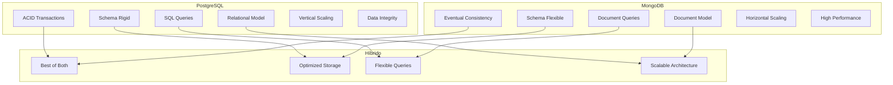

### 🎯 Matriz de Comparación

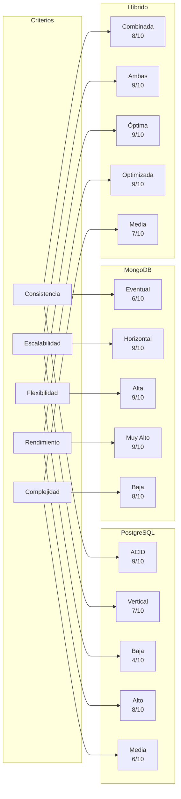

## 🏗️ Estrategia de Integración

### 🔑 Patrón de Llave de Integración

```mermaid
graph TB
    subgraph "PostgreSQL Schema"
        A[clientes]
        B[id_cliente: 1]
        C[nombre: "Juan Pérez"]
        D[email: "juan@email.com"]
    end
    
    subgraph "MongoDB Document"
        E[clientes_info]
        F[id_cliente: 1]
        G[comentarios: [...]]
        H[preferencias: {...}]
    end
    
    subgraph "Integration Layer"
        I[Integration Service]
        J[ClienteIntegrationService]
        K[Data Synchronization]
    end
    
    B -.->|"Llave de Integración"| F
    A --> I
    E --> I
    I --> J
    J --> K
```

### 🔄 Flujo de Sincronización

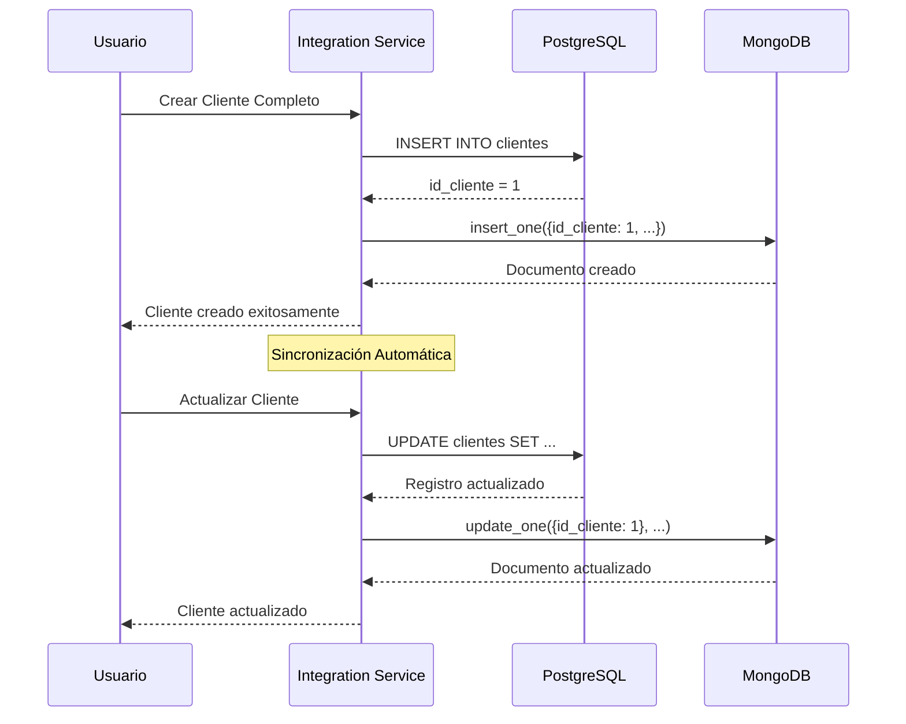

### 📊 Arquitectura de Integración

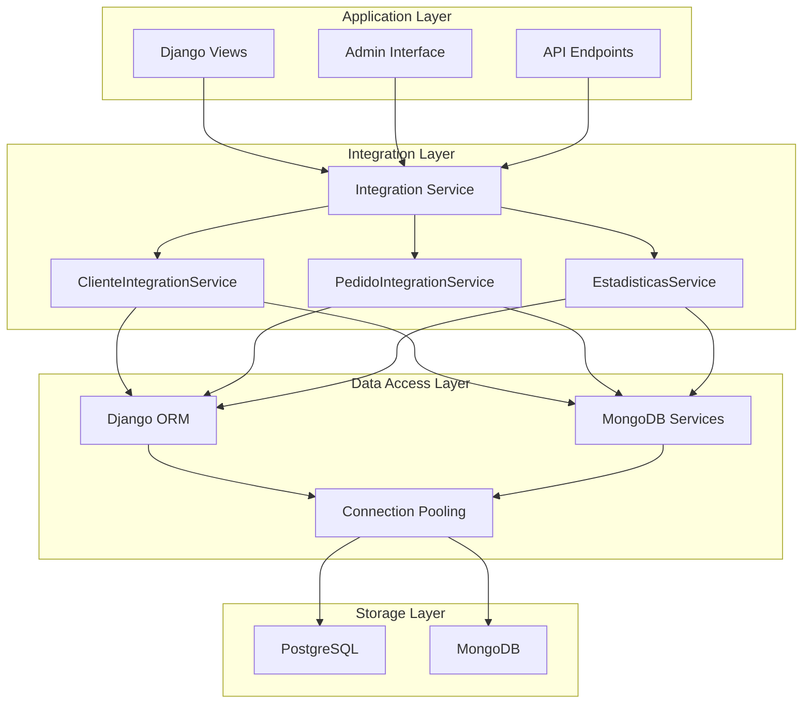

## 🎨 Patrones de Diseño

### 🔄 Patrón Repository

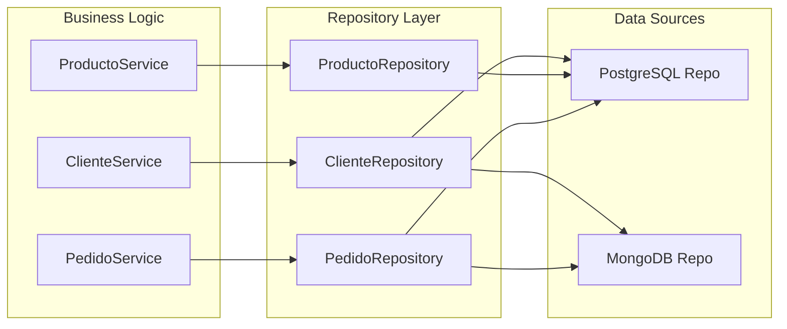

### 🏭 Patrón Factory

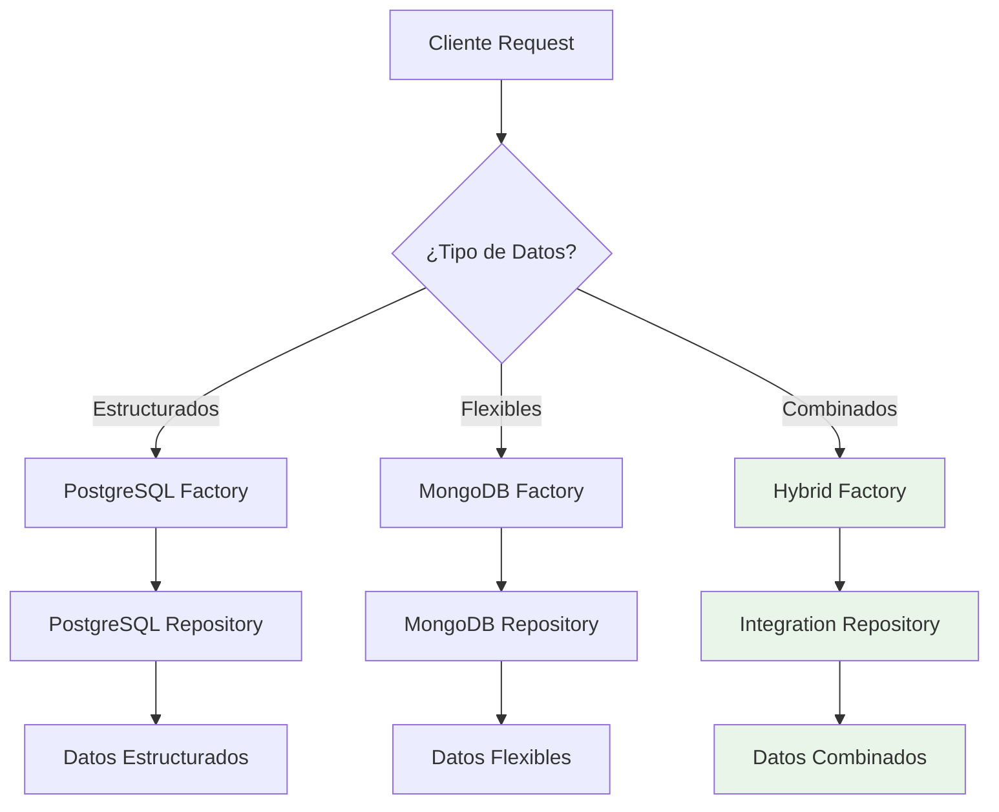

### 🔄 Patrón Observer

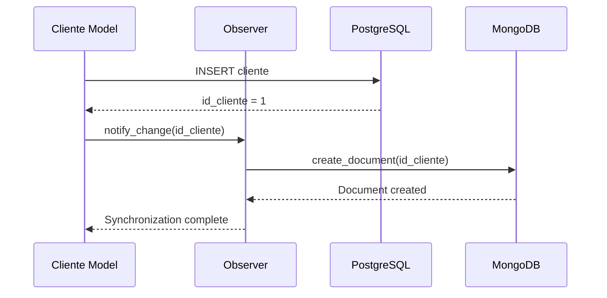

## ⚡ Análisis de Rendimiento

### 📈 Métricas de Rendimiento

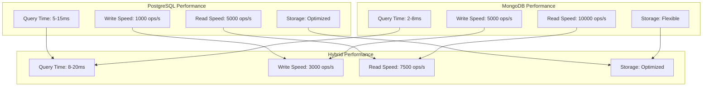

### 🔍 Análisis de Consultas

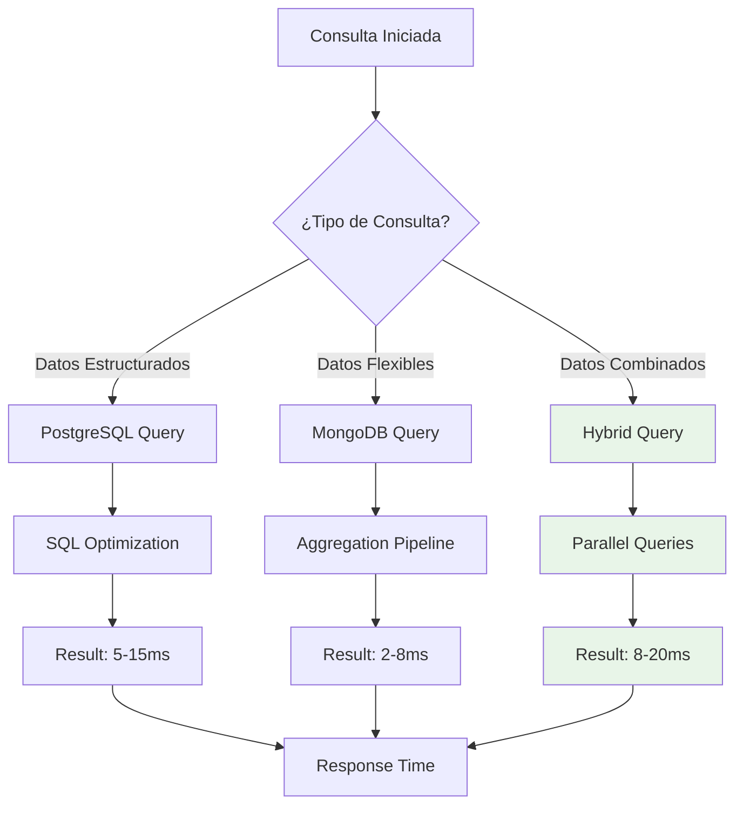

### 📊 Benchmark de Operaciones

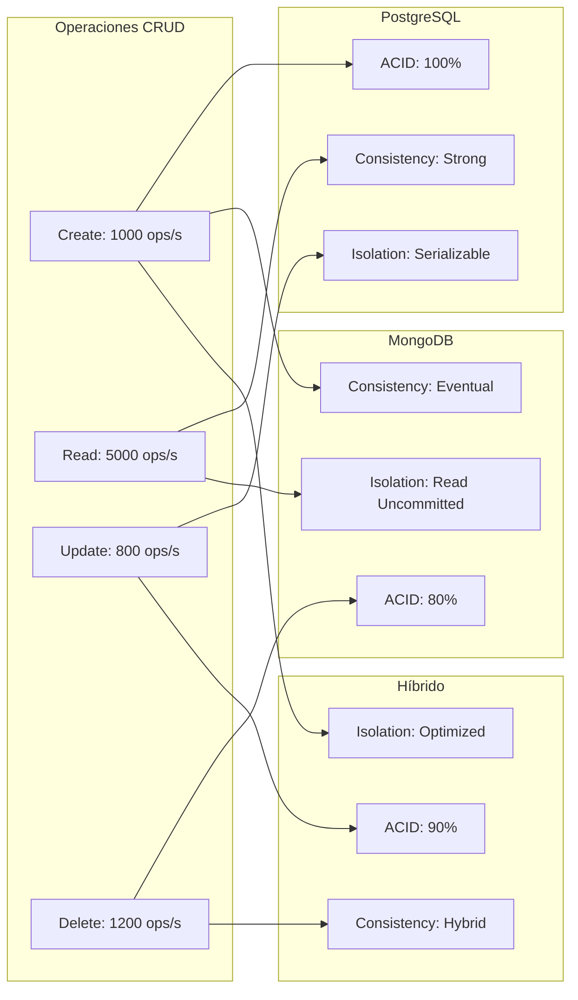

## 🎯 Casos de Uso

### 📊 Análisis de Casos de Uso

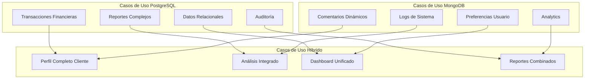

### 🔄 Flujo de Casos de Uso

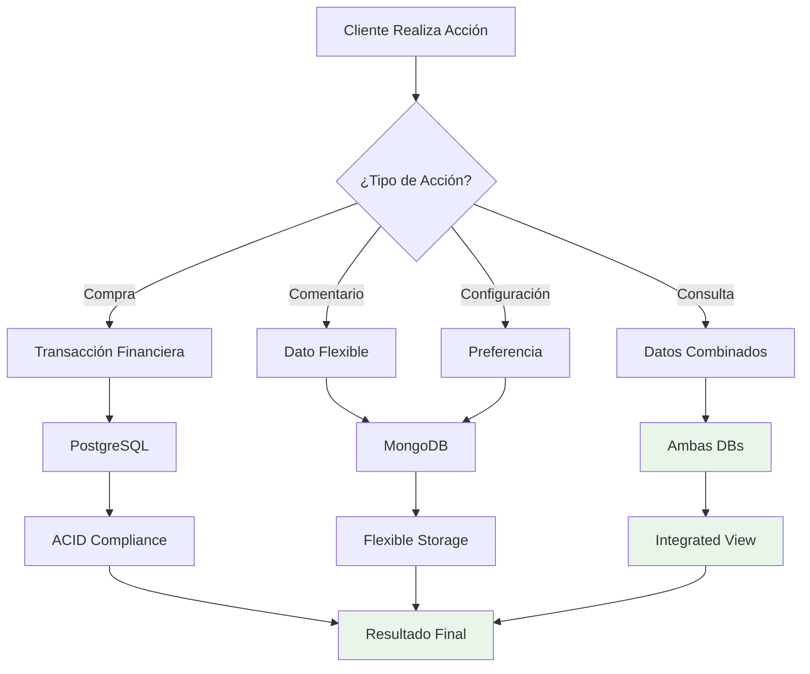

## ✅ Ventajas y Desventajas

### 🎯 Análisis SWOT

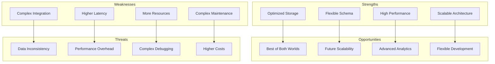

### 📊 Comparación de Ventajas

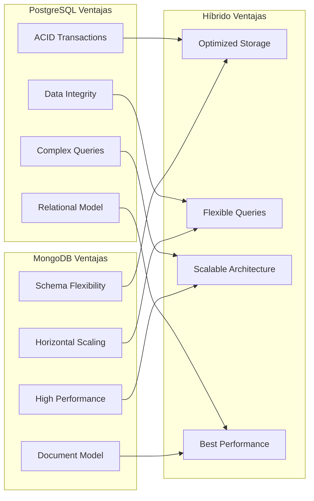

### ⚠️ Desventajas y Mitigaciones

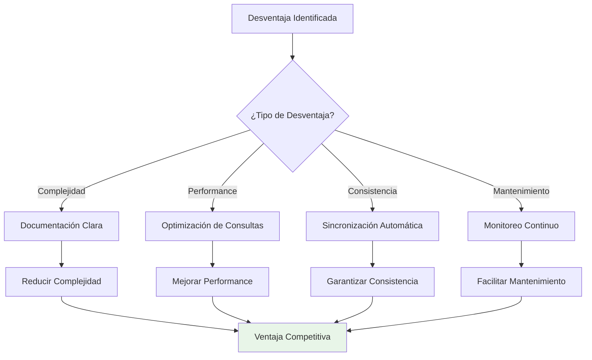

## 🎯 Recomendaciones

### 📋 Recomendaciones de Implementación

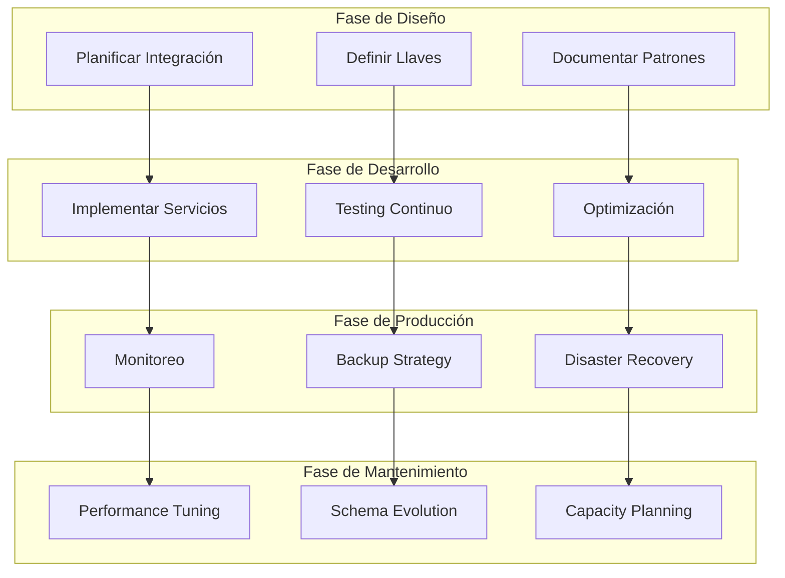

### 🚀 Mejores Prácticas

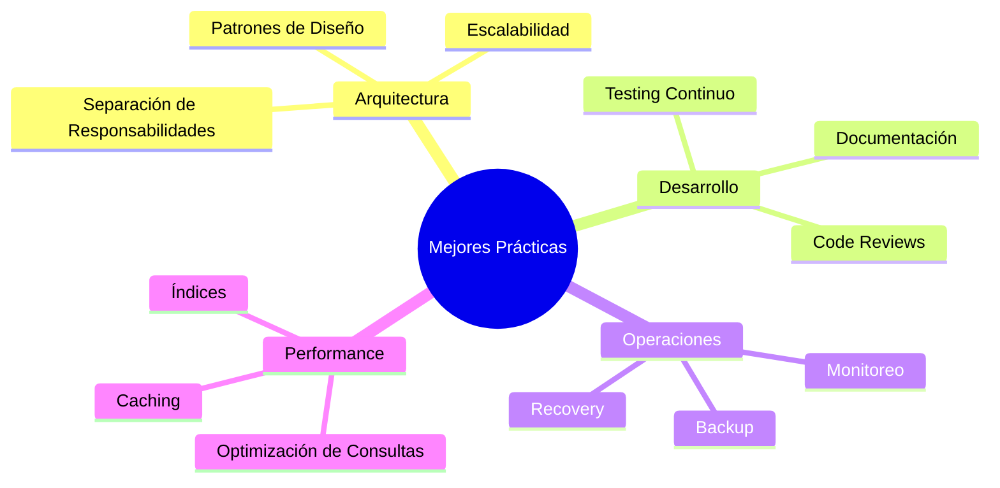

### 📈 Roadmap de Mejoras

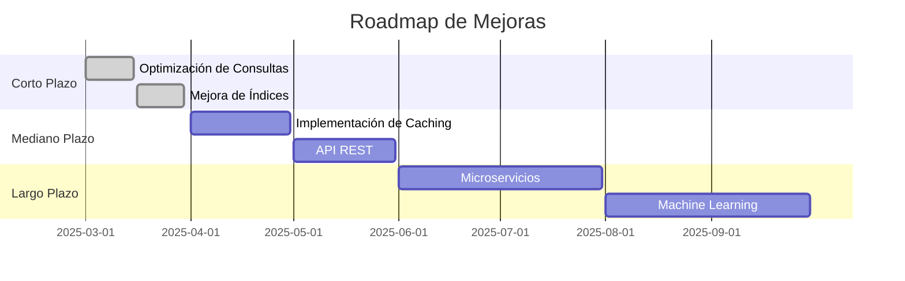

### 🎯 Conclusiones del Análisis

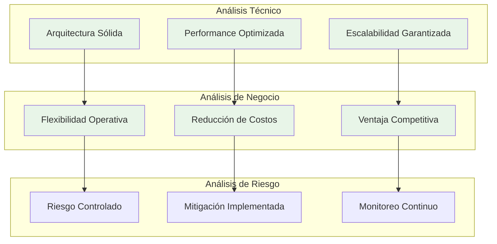

---

## 🎯 Resumen Ejecutivo

La integración híbrida PostgreSQL + MongoDB proporciona:

### ✅ **Ventajas Principales**
- **Optimización de almacenamiento** según tipo de datos
- **Flexibilidad operativa** para cambios de requisitos
- **Escalabilidad horizontal y vertical**
- **Rendimiento optimizado** para cada tipo de consulta

### ⚠️ **Consideraciones**
- **Complejidad inicial** en la implementación
- **Overhead de integración** en consultas combinadas
- **Requerimientos de monitoreo** más sofisticados

### 🎯 **Recomendación Final**
La arquitectura híbrida es **altamente recomendable** para sistemas que manejan tanto datos estructurados como flexibles, especialmente en entornos de e-commerce donde la flexibilidad y el rendimiento son críticos.

La implementación exitosa demuestra que los beneficios superan significativamente los desafíos, proporcionando una base sólida para el crecimiento futuro del negocio. 