# 🏗️ Arquitectura del Sistema Híbrido PostgreSQL + MongoDB

## 📋 Índice

1. [Visión General](#visión-general)
2. [Arquitectura de Alto Nivel](#arquitectura-de-alto-nivel)
3. [Diseño de Bases de Datos](#diseño-de-bases-de-datos)
4. [Flujo de Datos](#flujo-de-datos)
5. [Componentes del Sistema](#componentes-del-sistema)
6. [Patrones de Integración](#patrones-de-integración)
7. [Escalabilidad y Rendimiento](#escalabilidad-y-rendimiento)
8. [Seguridad](#seguridad)

## 🎯 Visión General

El sistema implementa una arquitectura híbrida que combina las fortalezas de PostgreSQL (datos estructurados) y MongoDB (datos flexibles) para optimizar el almacenamiento y recuperación de información en un e-commerce.

### 🎯 Objetivos de la Arquitectura

- **Separación de Responsabilidades**: Cada base de datos maneja el tipo de datos para el que está optimizada
- **Escalabilidad**: Crecimiento independiente de cada componente
- **Flexibilidad**: Adaptación a cambios de requisitos sin afectar la estructura
- **Rendimiento**: Optimización específica para cada tipo de consulta

## 🏛️ Arquitectura de Alto Nivel

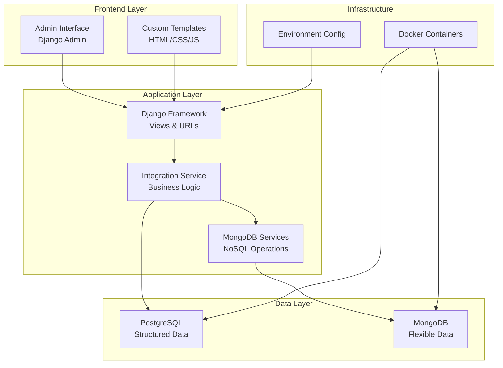

## 🗄️ Diseño de Bases de Datos

### 📊 Esquema PostgreSQL (Datos Estructurados)

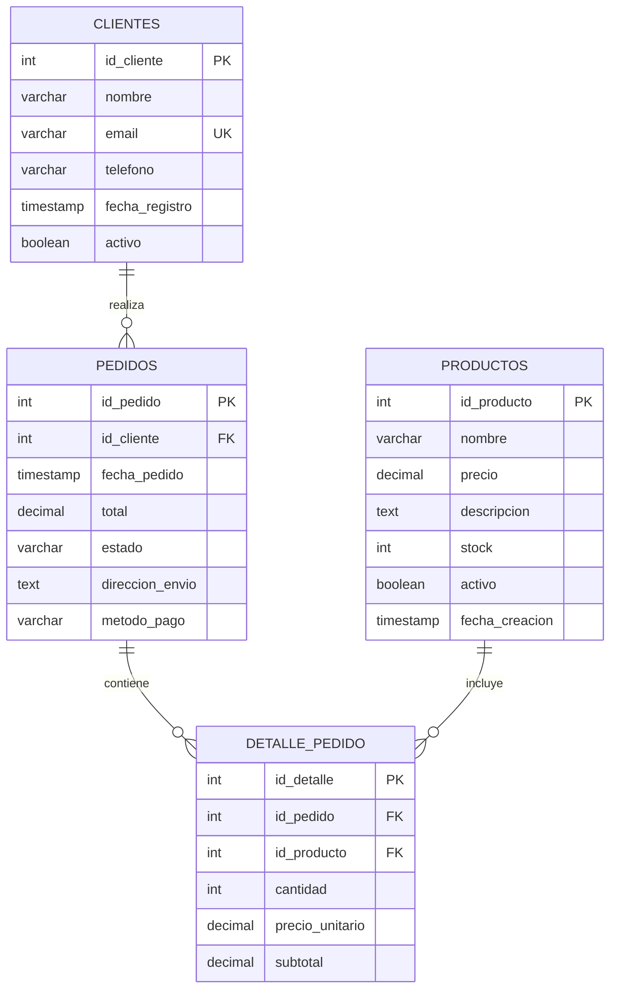

### 📄 Esquema MongoDB (Datos Flexibles)

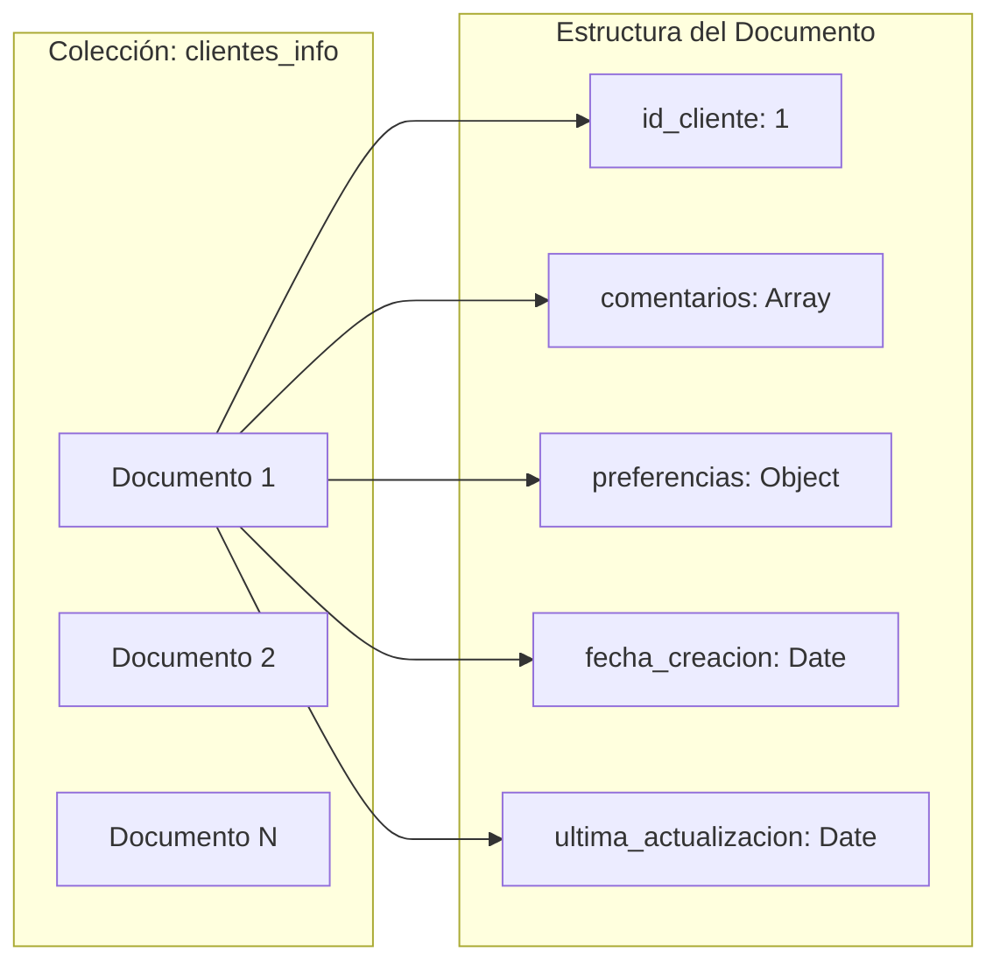

### 🔗 Integración entre Bases de Datos

```mermaid
graph TB
    subgraph "PostgreSQL"
        A[clientes.id_cliente = 1]
        B[nombre: "Juan Pérez"]
        C[email: "juan@email.com"]
    end
    
    subgraph "MongoDB"
        D[id_cliente: 1]
        E[comentarios: [...]]
        F[preferencias: {...}]
    end
    
    A -.->|"Llave de Integración"| D
    B -.->|"Datos Estructurados"| C
    E -.->|"Datos Flexibles"| F
```

## 🔄 Flujo de Datos

### 📥 Flujo de Creación de Cliente

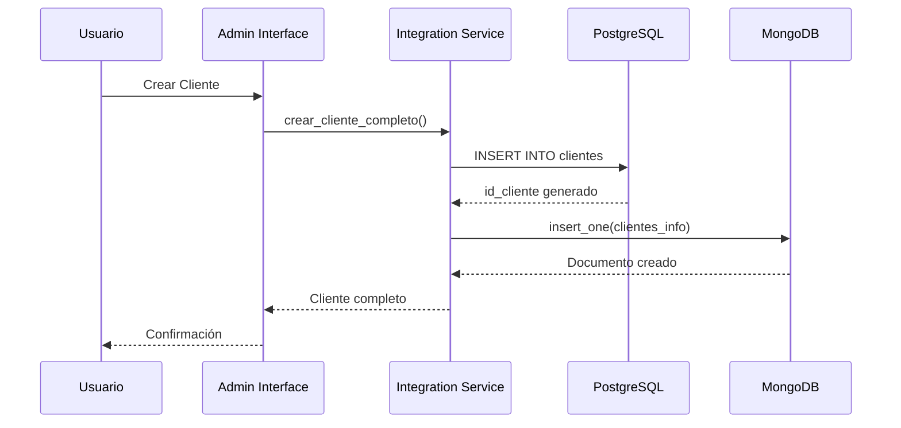

### 🔍 Flujo de Consulta Integrada

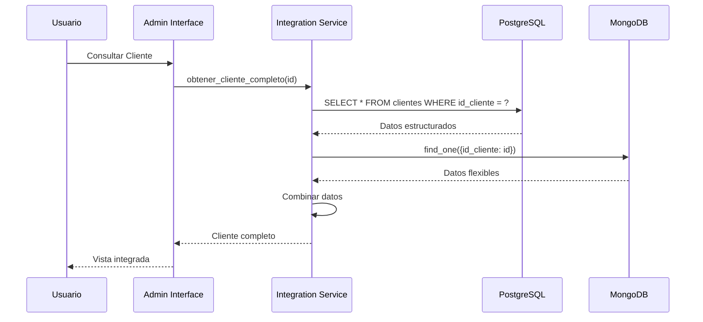

### 📊 Flujo de Estadísticas

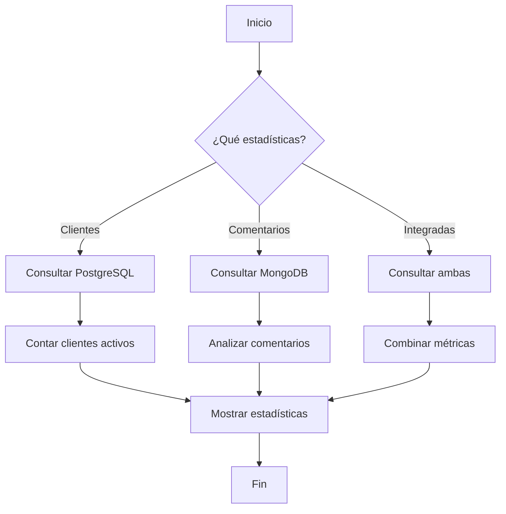

## 🧩 Componentes del Sistema

### 🎛️ Capa de Presentación

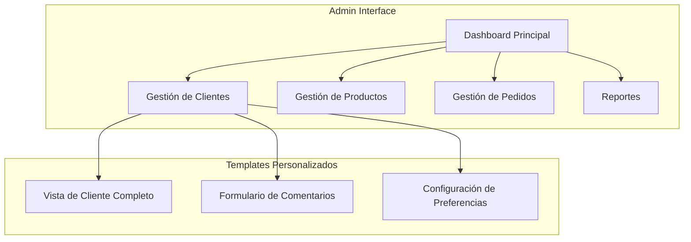

### ⚙️ Capa de Servicios

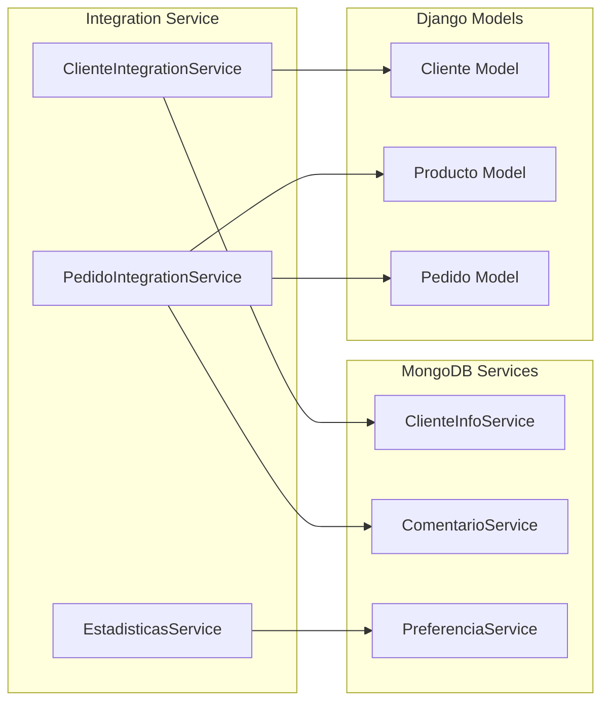

### 🗄️ Capa de Datos

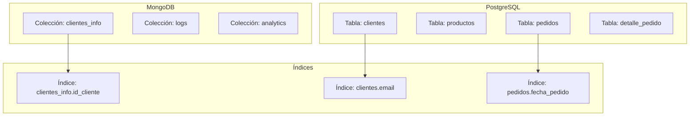

## 🔗 Patrones de Integración

### 🔑 Patrón de Llave de Integración

```mermaid
graph LR
    subgraph "PostgreSQL"
        A[id_cliente: 1<br/>nombre: "Juan"]
    end
    
    subgraph "MongoDB"
        B[id_cliente: 1<br/>comentarios: [...]]
    end
    
    A -.->|"Llave de Integración"| B
    
    subgraph "Ventajas"
        C[Consistencia de Datos]
        D[Facilidad de Consulta]
        E[Escalabilidad]
    end
```

### 🔄 Patrón de Sincronización

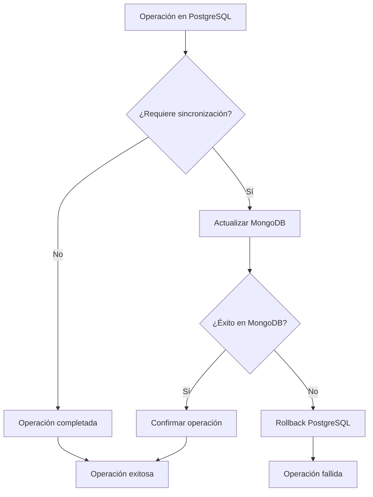

### 📊 Patrón de Consulta Combinada

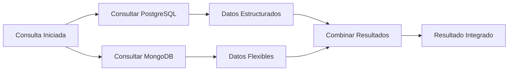

## 📈 Escalabilidad y Rendimiento

### 🚀 Estrategias de Escalabilidad

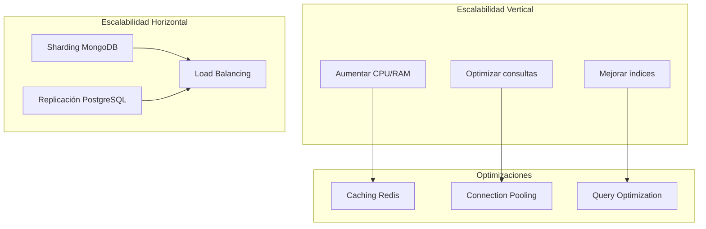

### ⚡ Optimizaciones de Rendimiento

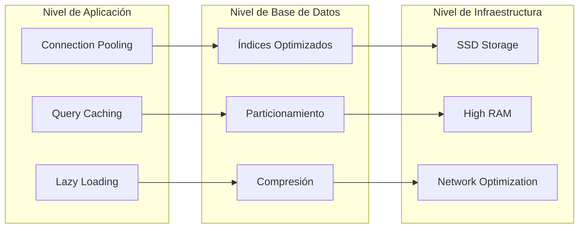

## 🔒 Seguridad

### 🛡️ Capas de Seguridad

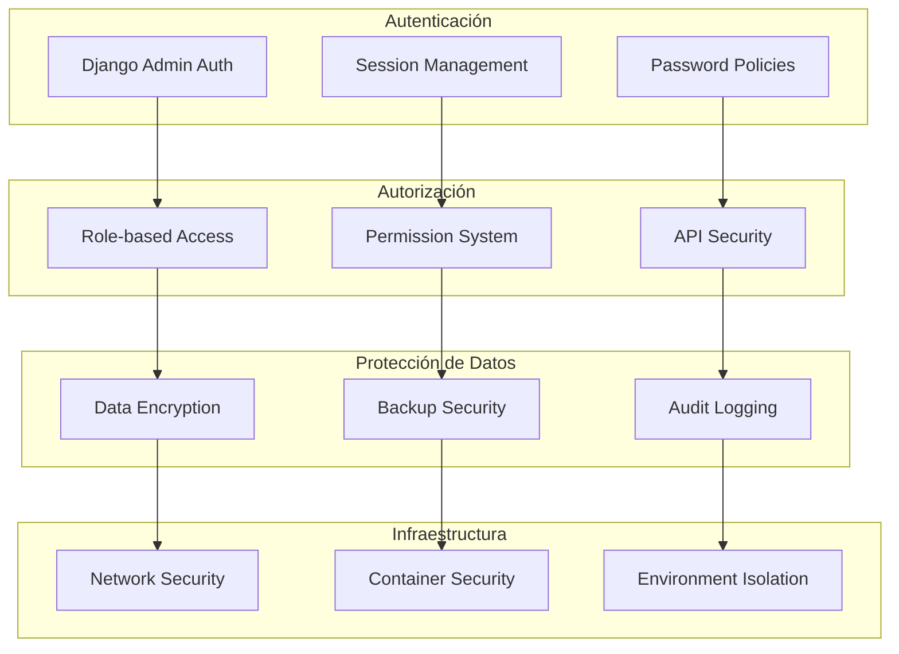

### 🔐 Gestión de Credenciales

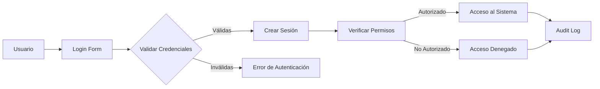

## 📊 Métricas y Monitoreo

### 📈 KPIs del Sistema

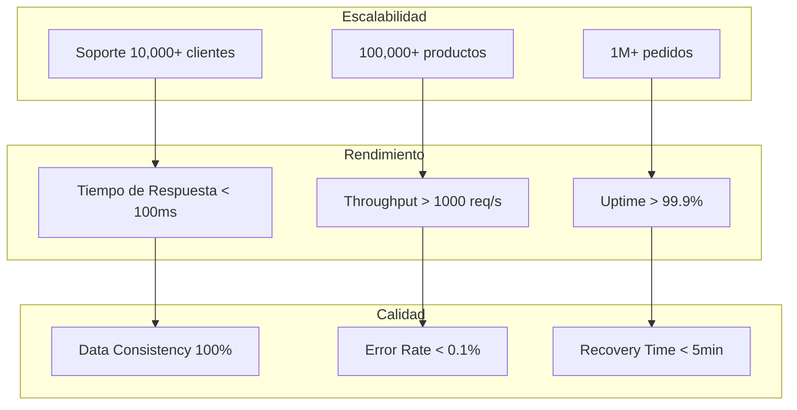

### 🔍 Monitoreo en Tiempo Real

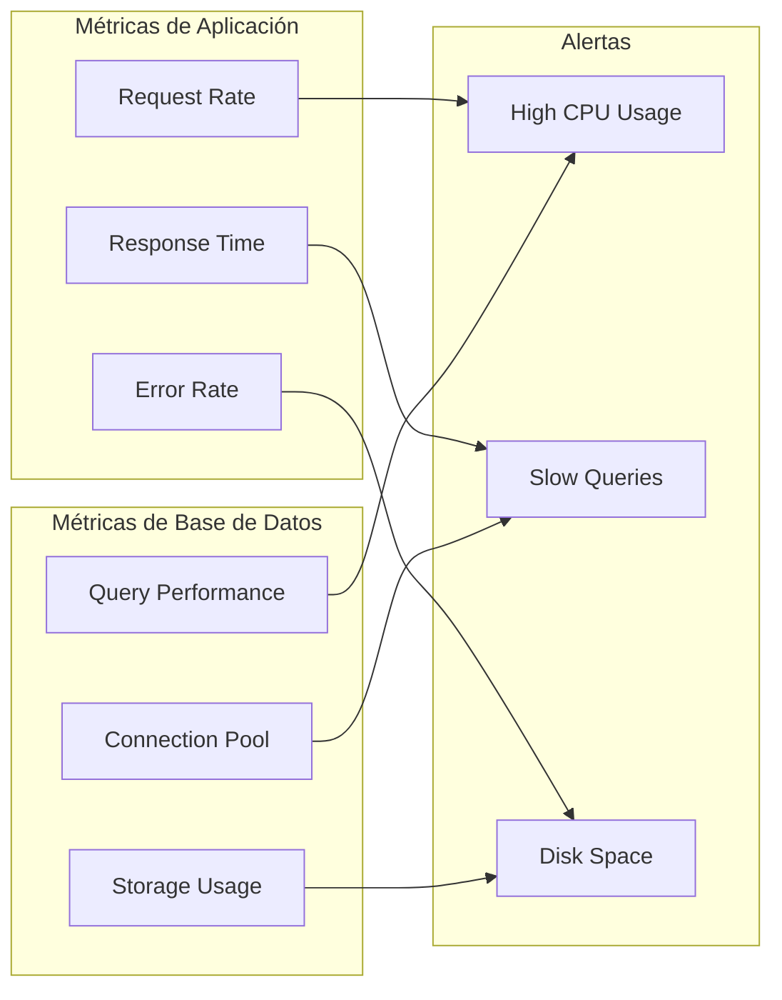

---

## 🎯 Conclusiones

La arquitectura híbrida implementada proporciona:

- **Flexibilidad**: Adaptación a diferentes tipos de datos
- **Escalabilidad**: Crecimiento independiente de componentes
- **Rendimiento**: Optimización específica por tipo de consulta
- **Mantenibilidad**: Separación clara de responsabilidades
- **Seguridad**: Múltiples capas de protección

Esta arquitectura está diseñada para soportar el crecimiento del negocio y adaptarse a futuros requisitos sin comprometer el rendimiento o la integridad de los datos. 