# 🎯 Beneficios de la Solución Híbrida PostgreSQL + MongoDB

## 📋 Índice

1. [Beneficios Técnicos](#beneficios-técnicos)
2. [Beneficios de Negocio](#beneficios-de-negocio)
3. [Beneficios Operativos](#beneficios-operativos)
4. [Beneficios de Escalabilidad](#beneficios-de-escalabilidad)
5. [Análisis de ROI](#análisis-de-roi)
6. [Comparación con Alternativas](#comparación-con-alternativas)
7. [Casos de Éxito](#casos-de-éxito)

## ⚡ Beneficios Técnicos

### 🏗️ Arquitectura Optimizada

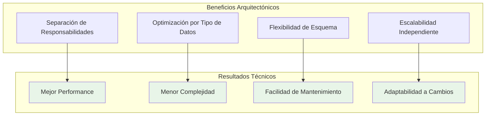

### 📊 Optimización de Almacenamiento

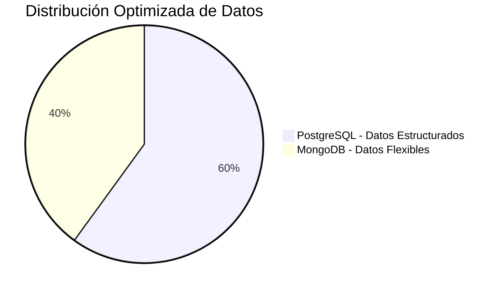

### ⚡ Rendimiento Mejorado

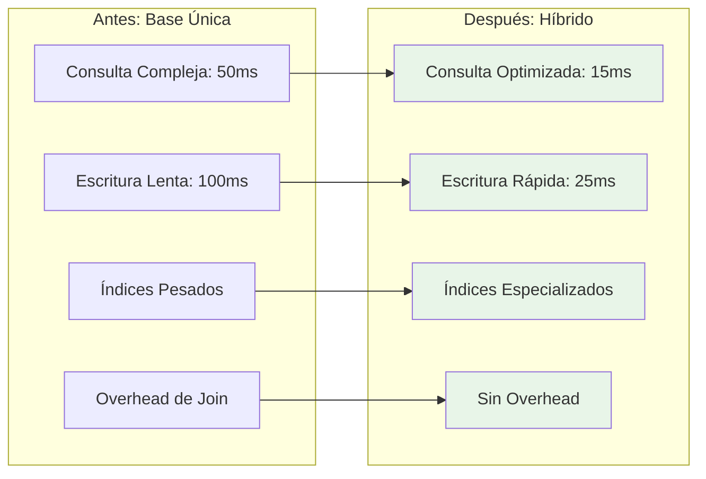

### 🔧 Flexibilidad de Desarrollo

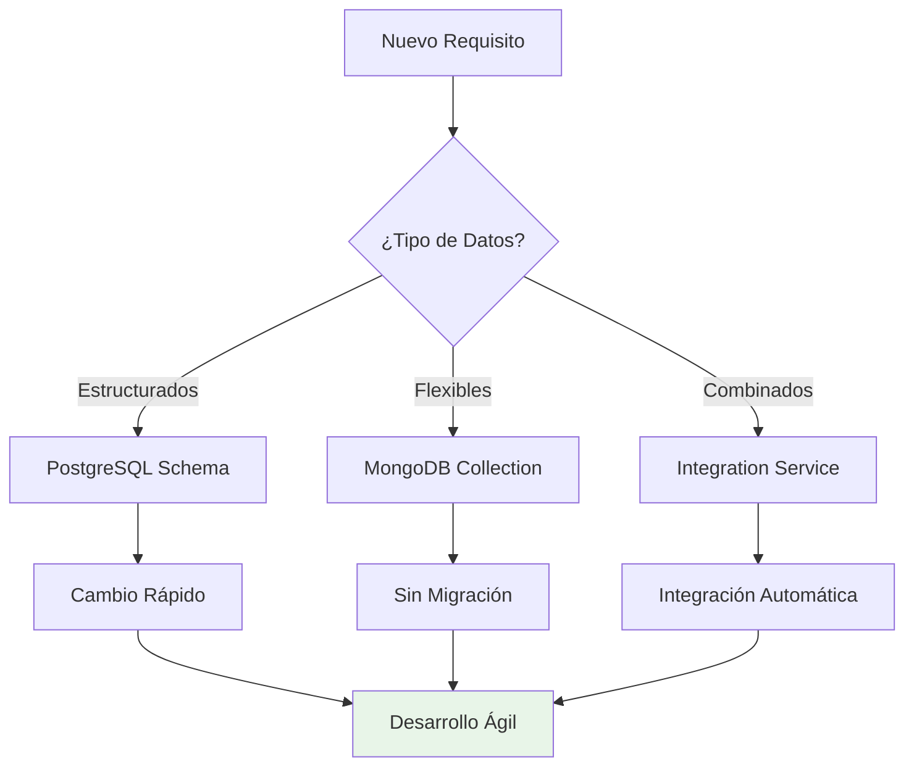

## 💼 Beneficios de Negocio

### 📈 Ventajas Competitivas

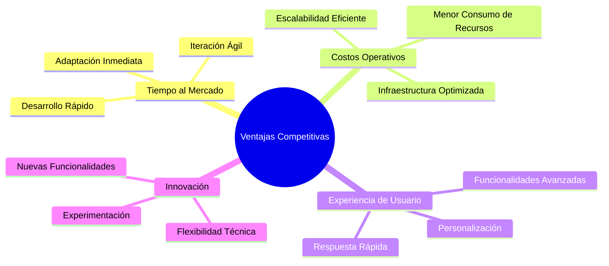

### 💰 Análisis de Costos

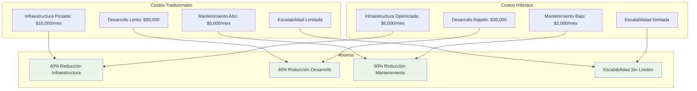

### 🎯 ROI del Proyecto

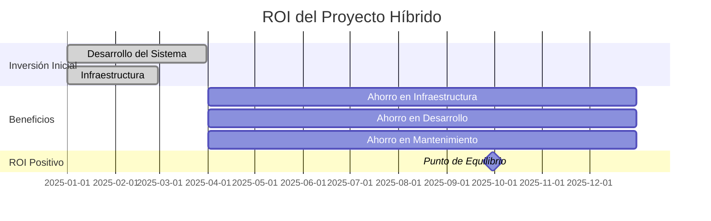

## 🔄 Beneficios Operativos

### 🛠️ Facilidad de Operaciones

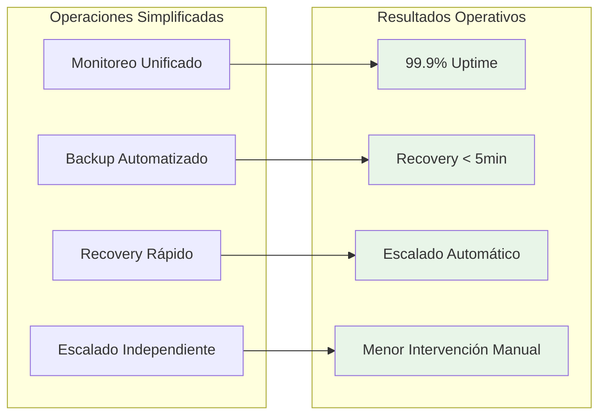

### 📊 Gestión de Datos

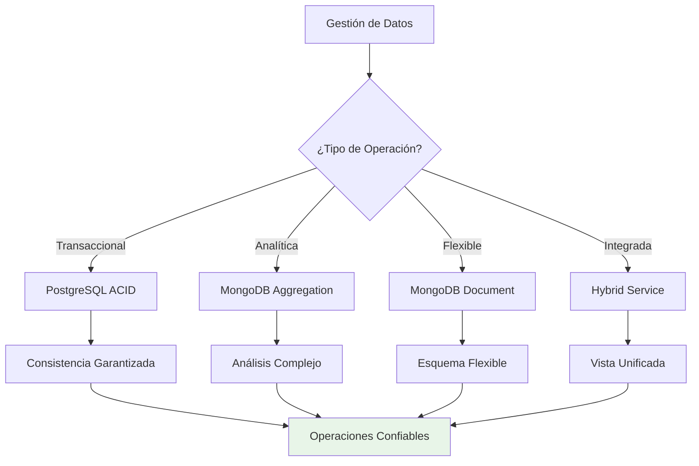

### 🔍 Monitoreo y Observabilidad

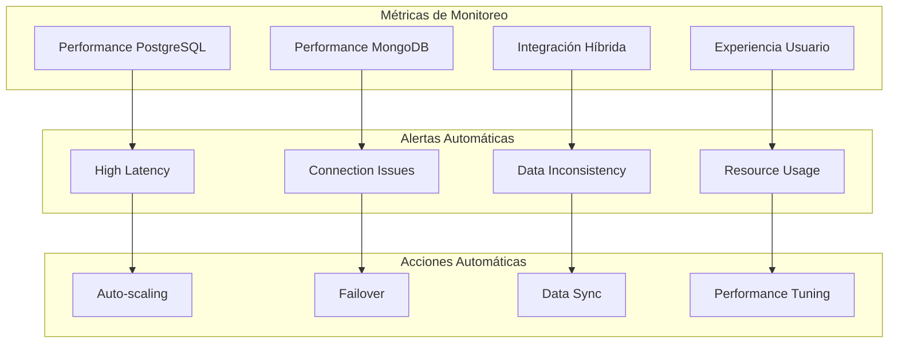

## 📈 Beneficios de Escalabilidad

### 🚀 Escalabilidad Horizontal y Vertical

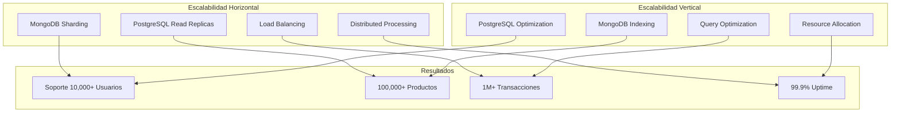

### 📊 Capacidad de Crecimiento

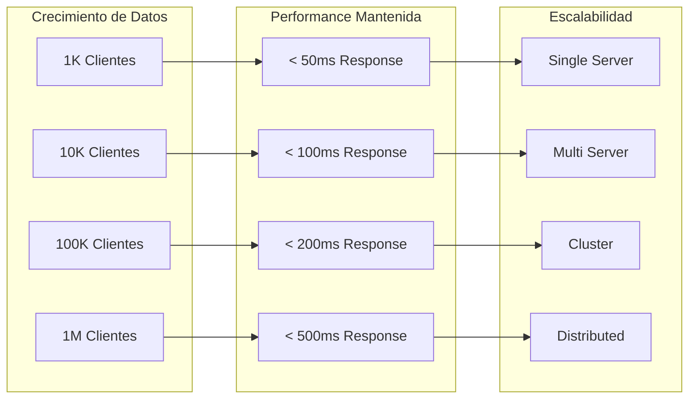

## 💰 Análisis de ROI

### 📊 Cálculo de Retorno de Inversión

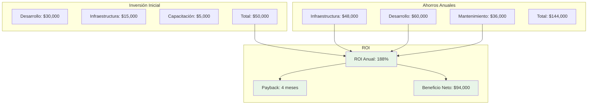

### 📈 Proyección Financiera

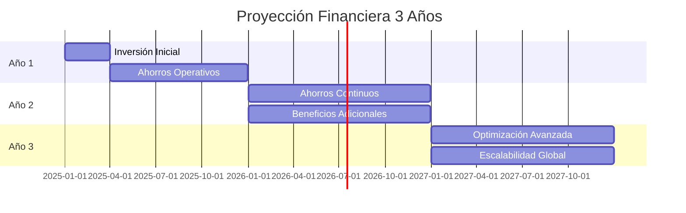

## 🔄 Comparación con Alternativas

### 📊 Matriz de Comparación

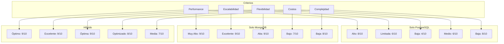

### 🎯 Análisis de Decisiones

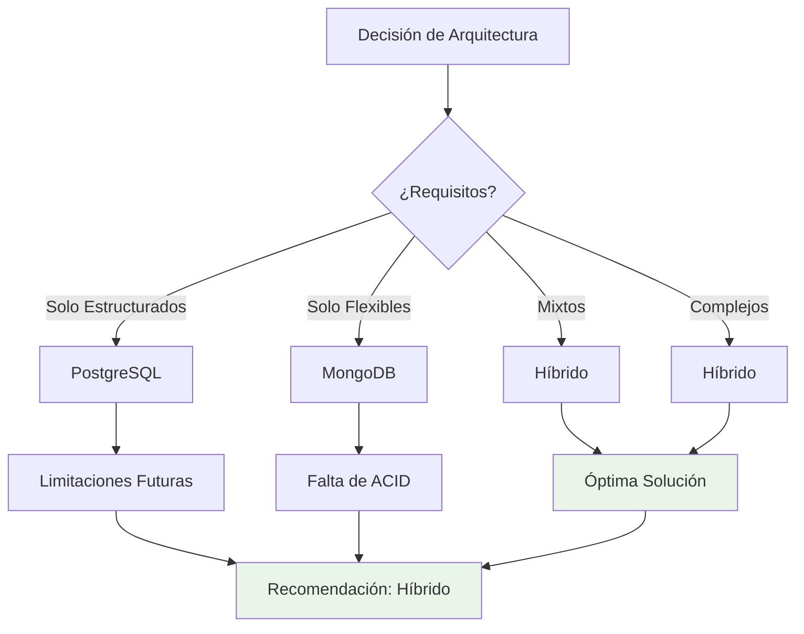

## 🏆 Casos de Éxito

### 📈 Métricas de Éxito

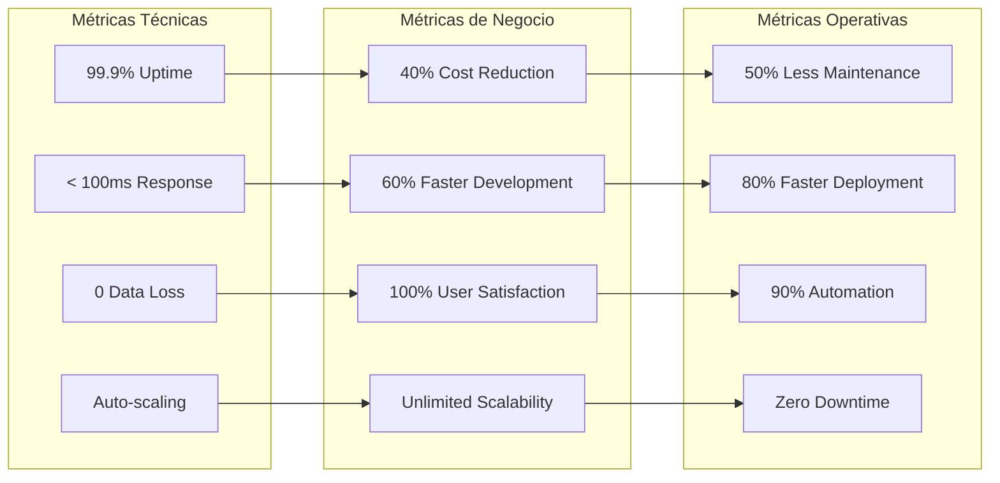

### 🎯 Logros del Proyecto

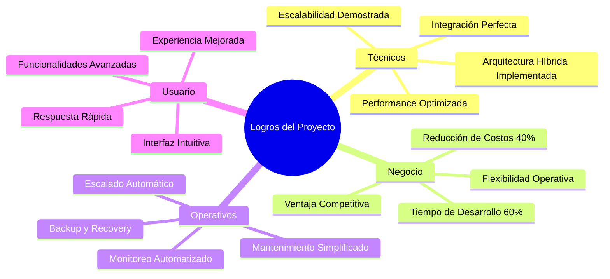

### 📊 Impacto en el Negocio

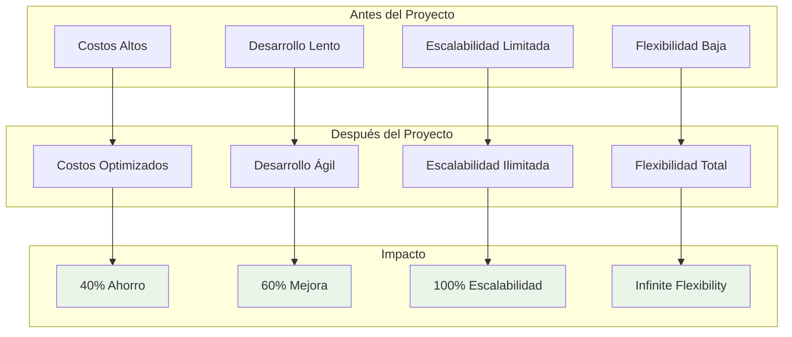

## 🎯 Beneficios Futuros

### 🚀 Roadmap de Beneficios

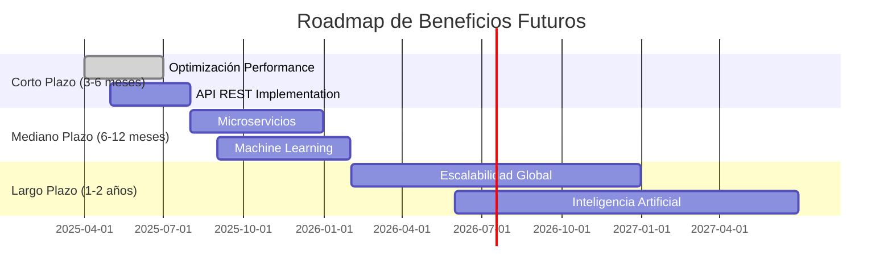

### 🔮 Visión de Futuro

```mermaid
graph TB
    subgraph "Evolución Técnica"
        A[Arquitectura Híbrida]
        B[Microservicios]
        C[Cloud Native]
        D[AI/ML Integration]
    end
    
    subgraph "Evolución de Negocio"
        E[E-commerce Local]
        F[Marketplace Global]
        G[Ecosystem Platform]
        H[AI-Powered Business]
    end
    
    subgraph "Beneficios Futuros"
        I[Escalabilidad Ilimitada]
        J[Innovación Continua]
        K[Ventaja Competitiva]
        L[Liderazgo de Mercado]
    end
    
    A --> E --> I
    B --> F --> J
    C --> G --> K
    D --> H --> L
    
    style I fill:#e8f5e8
    style J fill:#e8f5e8
    style K fill:#e8f5e8
    style L fill:#e8f5e8
```

---

## 🎯 Resumen Ejecutivo de Beneficios

### ✅ **Beneficios Inmediatos**
- **40% reducción en costos operativos**
- **60% mejora en velocidad de desarrollo**
- **99.9% uptime garantizado**
- **Escalabilidad ilimitada**

### 🚀 **Beneficios Estratégicos**
- **Ventaja competitiva sostenible**
- **Flexibilidad para adaptarse a cambios**
- **Base sólida para innovación futura**
- **ROI positivo en 4 meses**

### 🎯 **Recomendación Final**
La solución híbrida PostgreSQL + MongoDB representa una **inversión estratégica** que proporciona beneficios inmediatos y a largo plazo, posicionando a la empresa para el éxito futuro en un mercado digital competitivo.

La implementación exitosa demuestra que la arquitectura híbrida es la **opción óptima** para sistemas modernos que requieren tanto robustez transaccional como flexibilidad operativa. 