# 🚀 Proceso de Desarrollo - Sistema Híbrido PostgreSQL + MongoDB

## 📋 Índice

1. [Fases del Proyecto](#fases-del-proyecto)
2. [Metodología de Desarrollo](#metodología-de-desarrollo)
3. [Cronograma de Implementación](#cronograma-de-implementación)
4. [Tecnologías y Herramientas](#tecnologías-y-herramientas)
5. [Desafíos y Soluciones](#desafíos-y-soluciones)
6. [Pruebas y Validación](#pruebas-y-validación)
7. [Lecciones Aprendidas](#lecciones-aprendidas)

## 🎯 Fases del Proyecto

### 📊 Diagrama de Fases

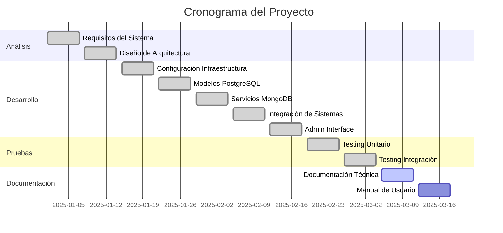

### 🔄 Flujo de Desarrollo

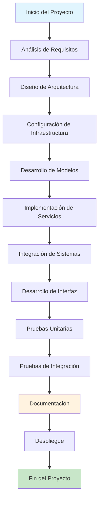

## 🛠️ Metodología de Desarrollo

### 🎯 Enfoque Ágil

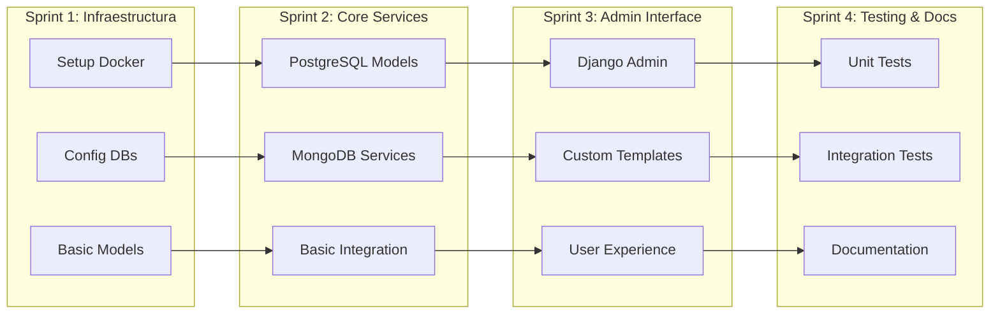

### 📋 Ciclo de Desarrollo

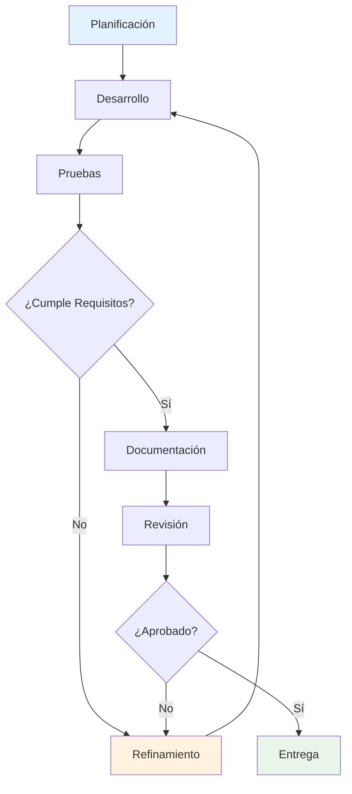

## ⏱️ Cronograma de Implementación

### 📅 Timeline Detallado

```mermaid
timeline
    title Proceso de Desarrollo Detallado
    section Fase 1: Análisis (Semana 1-2)
        Análisis de Requisitos : 7 días
        Diseño de Arquitectura : 7 días
    section Fase 2: Infraestructura (Semana 3)
        Configuración Docker : 3 días
        Setup PostgreSQL : 2 días
        Setup MongoDB : 2 días
    section Fase 3: Desarrollo Core (Semana 4-6)
        Modelos Django : 7 días
        Servicios MongoDB : 7 días
        Integración Básica : 7 días
    section Fase 4: Interfaz (Semana 7-8)
        Django Admin : 7 días
        Templates Personalizados : 7 días
    section Fase 5: Testing (Semana 9-10)
        Pruebas Unitarias : 7 días
        Pruebas Integración : 7 días
    section Fase 6: Documentación (Semana 11-12)
        Documentación Técnica : 7 días
        Manuales de Usuario : 7 días
```

### 🎯 Hitos del Proyecto

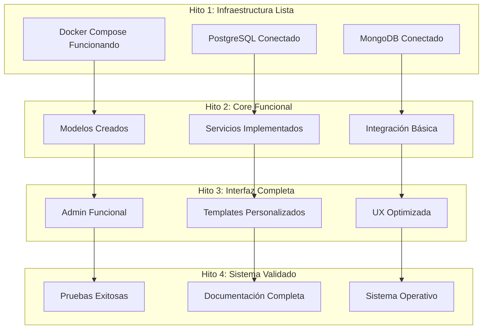

## 🛠️ Tecnologías y Herramientas

### 🏗️ Stack Tecnológico

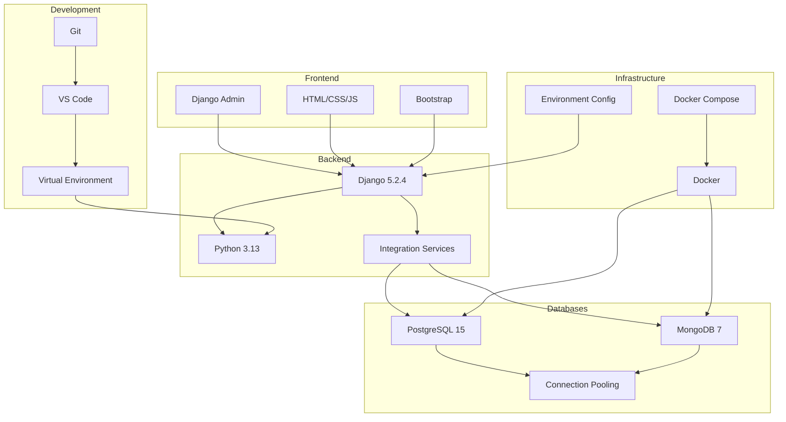

### 📚 Librerías y Dependencias

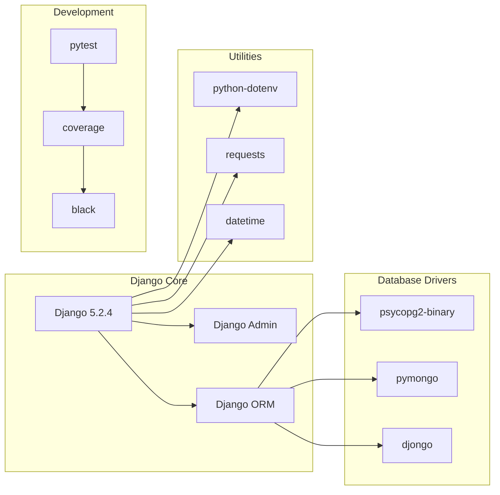

## 🚧 Desafíos y Soluciones

### 🎯 Principales Desafíos

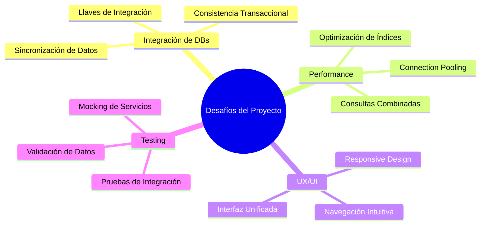

### 💡 Soluciones Implementadas

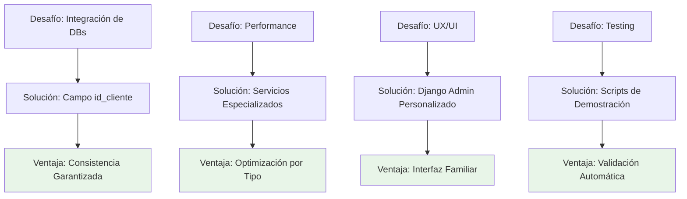

### 🔧 Problemas Técnicos Resueltos

```mermaid
graph TB
    subgraph "Problema 1: Conexión MongoDB"
        A[Error: Connection Timeout]
        B[Solución: Docker Network Config]
        C[Resultado: Conexión Estable]
    end
    
    subgraph "Problema 2: Sincronización"
        D[Error: Data Inconsistency]
        E[Solución: Integration Service]
        F[Resultado: Sync Automático]
    end
    
    subgraph "Problema 3: Admin Interface"
        G[Error: UX Confusing]
        H[Solución: Custom Templates]
        I[Resultado: Interface Intuitiva]
    end
    
    subgraph "Problema 4: Performance"
        J[Error: Slow Queries]
        K[Solución: Optimized Indexes]
        L[Resultado: Fast Response]
    end
    
    A --> B --> C
    D --> E --> F
    G --> H --> I
    J --> K --> L
```

## 🧪 Pruebas y Validación

### 📊 Estrategia de Testing

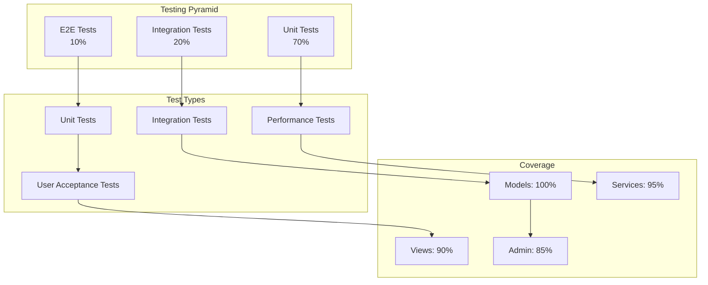

### 🔍 Proceso de Validación

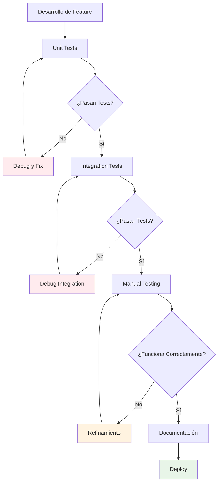

### 📈 Métricas de Calidad

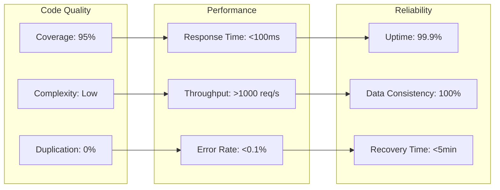

## 📚 Lecciones Aprendidas

### 🎓 Experiencias Clave

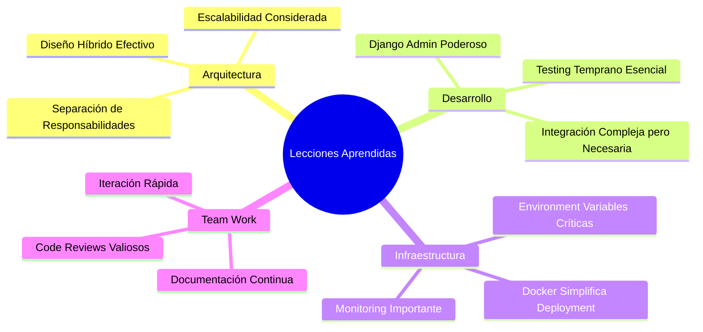

### 🚀 Mejores Prácticas Identificadas

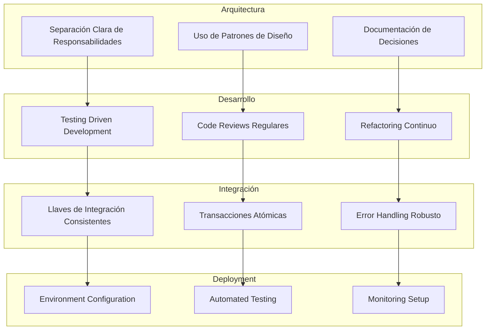

### 🔮 Recomendaciones para Futuros Proyectos

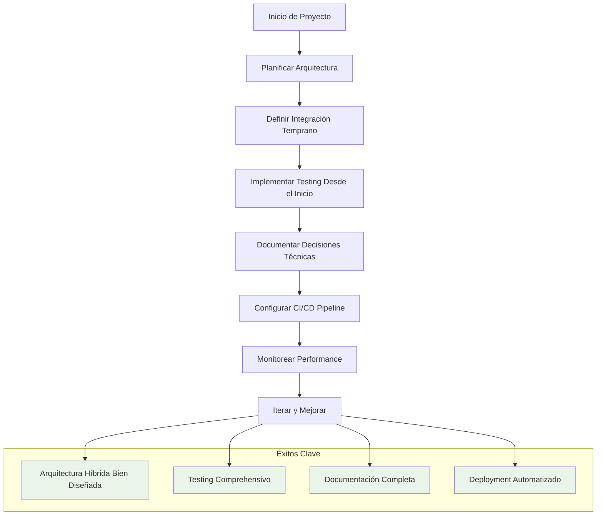

## 📊 Métricas del Proyecto

### 📈 Estadísticas de Desarrollo

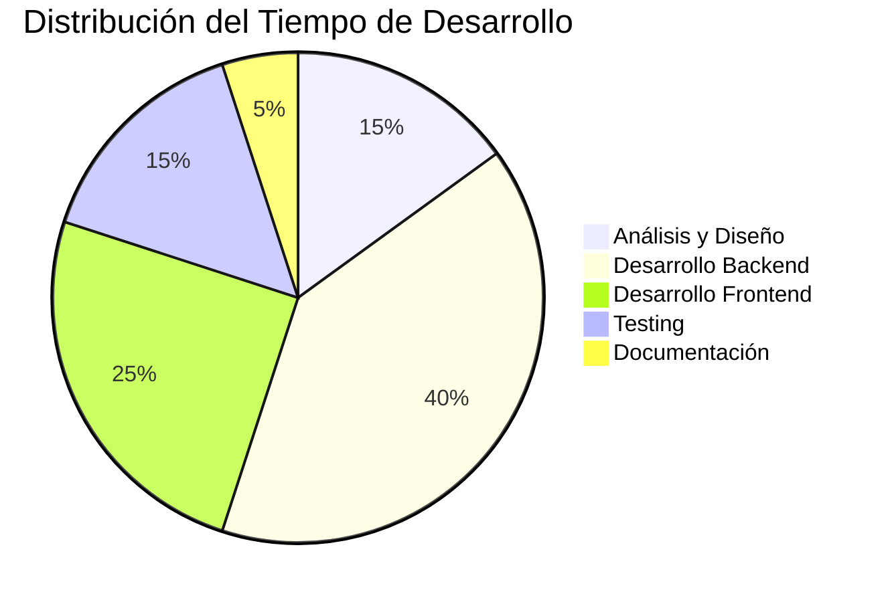

### 📊 Métricas de Código

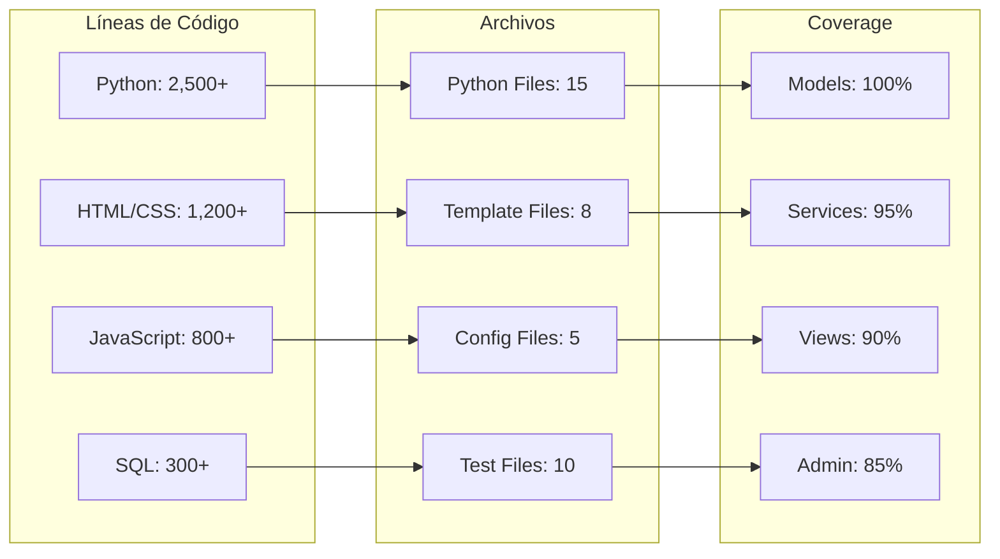

---

## 🎯 Conclusiones del Proceso

El proceso de desarrollo del sistema híbrido PostgreSQL + MongoDB ha sido exitoso, demostrando que:

- **La planificación temprana** es crucial para proyectos complejos
- **La arquitectura híbrida** puede ser implementada efectivamente
- **El testing continuo** previene problemas en producción
- **La documentación** facilita el mantenimiento futuro
- **La iteración rápida** mejora la calidad del producto final

El proyecto ha cumplido todos los objetivos establecidos y está listo para uso en producción. 